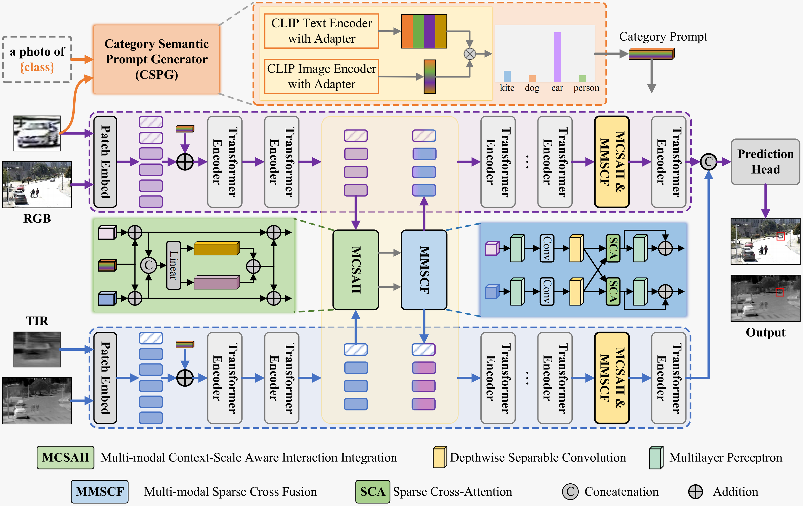
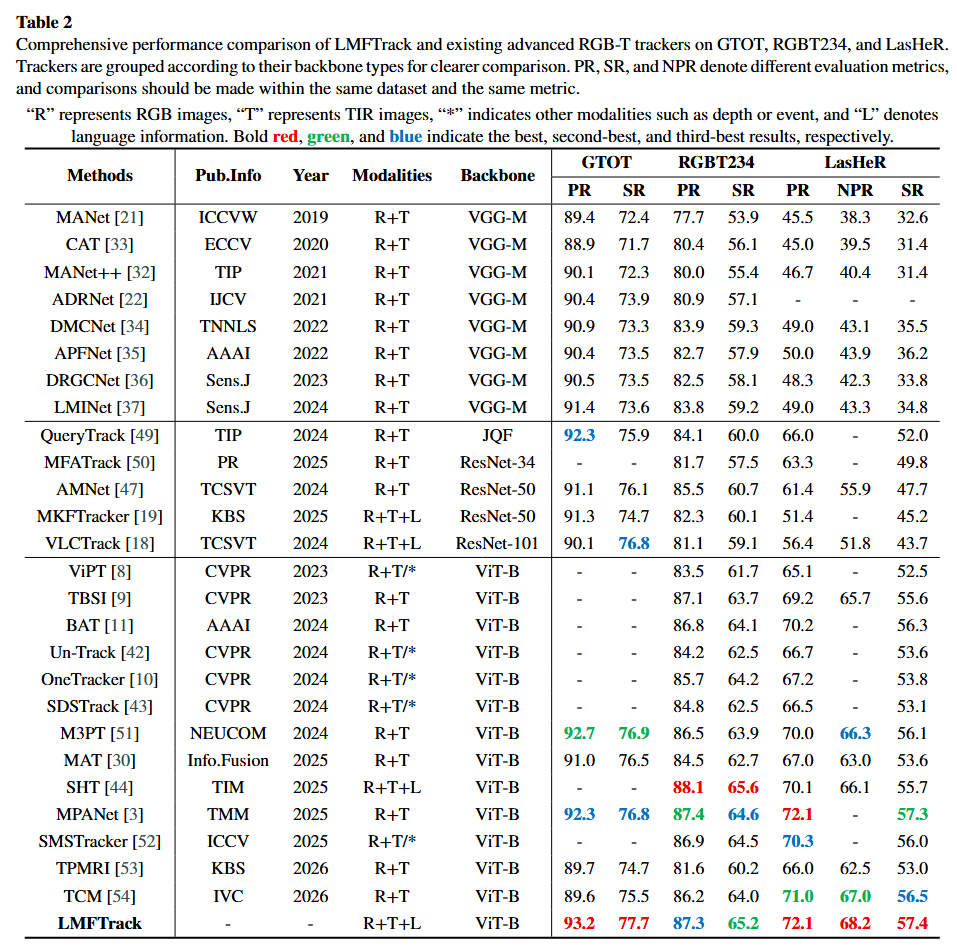
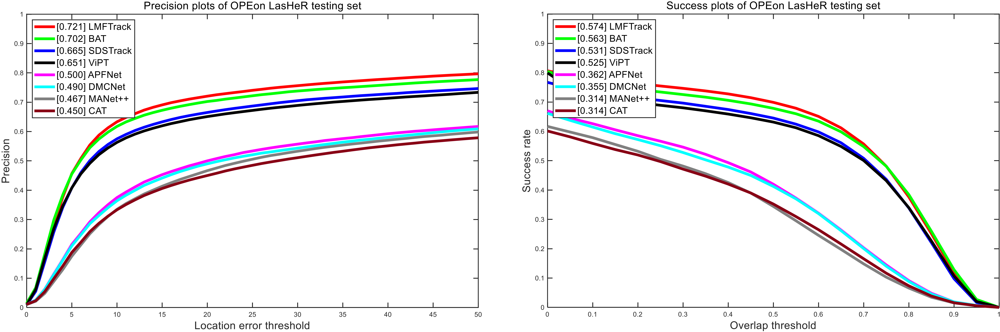
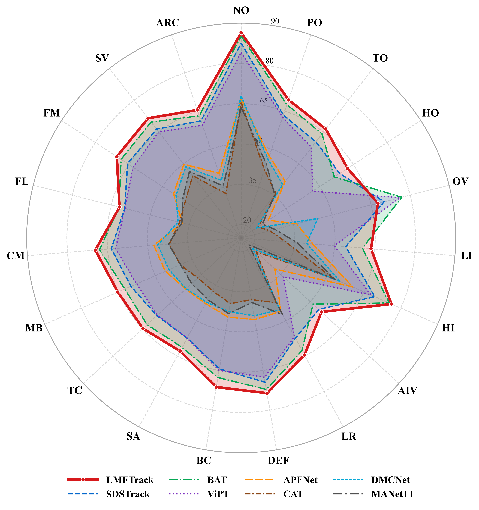
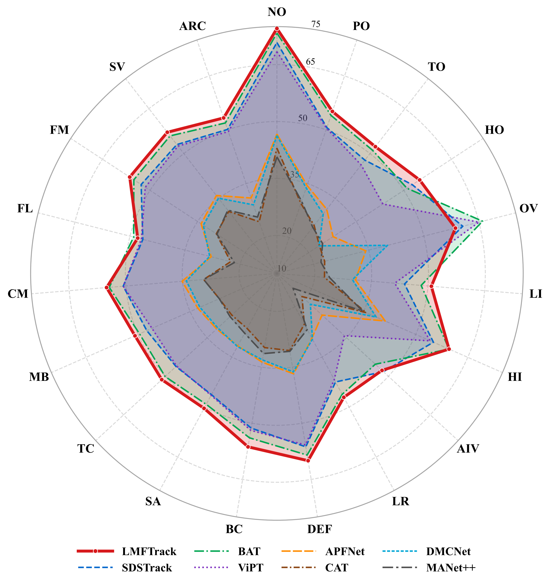

# LMFTrack

Official implementation of **“Semantic Language-guided Multi-modal Context-Scale Aware and Sparse Fusion for RGB-T Tracking.”**

LMFTrack is a language-guided RGB-T tracking framework that integrates category-level semantic priors, context-scale-aware multimodal interaction, and selective sparse cross-modal fusion.

## Overview

RGB-T tracking combines RGB and thermal infrared information to improve tracking robustness under challenging conditions such as low illumination, occlusion, adverse weather, scale variation, and background interference.

LMFTrack consists of three principal components:

- **Category Semantic Prompt Generator (CSPG):** selects a category-level semantic prompt according to the RGB template currently maintained by the online tracking pipeline.
- **Multi-modal Context-Scale Aware Interaction Integration (MCSAII):** jointly models non-local contextual dependencies and multi-scale spatial structures.
- **Multi-modal Sparse Cross Fusion (MMSCF):** preserves dominant cross-modal channel correspondences through channel-wise Top-K sparse cross-attention.

## Framework

<p align="center">
  
</p>

<p align="center">
  <b>Overall architecture of the proposed LMFTrack framework.</b>
</p>

LMFTrack first generates a category-level semantic prompt from the RGB template maintained by the online tracking pipeline. The generated semantic prompt is incorporated into the RGB and TIR feature representations. MCSAII jointly models contextual dependencies and multi-scale spatial structures, while MMSCF selectively preserves dominant cross-modal channel correspondences through channel-wise Top-K sparse cross-attention.

## Installation

### Environment

LMFTrack was developed and evaluated using the following principal environment:

| Component | Version |
|:---|:---|
| Operating system | Ubuntu 22.04 |
| Python | 3.9 |
| PyTorch | 1.10.0 |
| Torchvision | 0.11.0 |
| Torchaudio | 0.10.0 |
| CUDA Toolkit | 11.3 |
| CLIP implementation | Official OpenAI CLIP |
| CLIP backbone | ViT-B/32 |
| CLIP embedding dimension | 512 |

CSPG adopts the official OpenAI CLIP implementation with the ViT-B/32 backbone. The image and text embeddings are both 512-dimensional. The CLIP image and text encoders remain frozen during training and inference, while the shared lightweight adapter and the prompt projection layer are jointly optimized with the tracker.

### Create the Conda Environment

```bash
conda create -n lmftrack python=3.9 -y
conda activate lmftrack
```

### Install the Dependencies

Clone the repository:

```bash
git clone https://github.com/lx-ynu/LMFTrack.git
cd LMFTrack
```

Run the installation script:

```bash
bash install.sh
```

Alternatively, make the script executable before running it:

```bash
chmod +x install.sh
./install.sh
```

The installation script installs PyTorch 1.10.0, Torchvision 0.11.0, Torchaudio 0.10.0, CUDA Toolkit 11.3, the official OpenAI CLIP implementation, and the principal dependencies required by LMFTrack.

### Verify the Installation

```bash
python -c "import torch, torchvision, clip; print('PyTorch:', torch.__version__); print('Torchvision:', torchvision.__version__); print('CLIP:', clip.__file__)"
```

The expected PyTorch and Torchvision versions are:

```text
PyTorch: 1.10.0
Torchvision: 0.11.0
```

## Main Results

### Quantitative Comparison

<p align="center">
  
</p>

<p align="center">
  <b>Performance comparison on GTOT, RGBT234, and LasHeR.</b>
</p>

### LasHeR Precision and Success Curves

<p align="center">
  
</p>

<p align="center">
  <b>Precision and success plots on the LasHeR testing set.</b>
</p>

### Attribute-based Evaluation on LasHeR

<table>
  <tr>
    <td align="center" width="50%">
      
      <br>
      <b>Attribute-based PR comparison</b>
    </td>
    <td align="center" width="50%">
      
      <br>
      <b>Attribute-based SR comparison</b>
    </td>
  </tr>
</table>

The attribute-based evaluation covers 19 challenging conditions in LasHeR, including occlusion, illumination variation, low resolution, deformation, background clutter, similar appearance, thermal crossover, motion blur, camera motion, fast motion, scale variation, and aspect-ratio change.

## Main Components

### Category Semantic Prompt Generator

CSPG adopts **CLIP ViT-B/32**, whose image and text embeddings are 512-dimensional. The CLIP image encoder and text encoder remain frozen during training and inference.

A shared lightweight adapter is applied to both image and text embeddings. The adapter operates on the 512-dimensional CLIP representations before the selected textual feature is projected to the ViT token dimension.

The complete COCO-80 vocabulary is adopted as a fixed set of coarse semantic anchors. For each maintained RGB template, CSPG computes the matching probabilities between the visual representation and all candidate category prompts and selects the best-matching prompt through Top-1 routing.

The default prompt template is:

```text
a photo of {class}
```

The selected prompt is used as a category-level semantic cue rather than as a final target-classification result. When a target does not exactly belong to the predefined category vocabulary, CSPG may associate it with a semantically related coarse category.

### Online Template Update

The RGB and TIR templates are initialized using the ground-truth bounding box in the first frame.

During online tracking, the RGB and TIR templates are synchronously replaced when the tracking score exceeds the update threshold:

```text
update_threshold = 0.88
```

After each RGB template replacement, CSPG recomputes the category-level semantic prompt according to the updated template. Between two adjacent template replacement events, the previously selected prompt is retained.

### Multi-modal Context-Scale Aware Interaction Integration

MCSAII consists of two parallel branches:

- **Non-local Context Attention (NLCA):** aggregates global contextual information through convolutional transformation, global context pooling, and attention reweighting.
- **Scale-aware Multi-dimensional Spatial Attention (SMSA):** models spatial structures along the height and width dimensions using grouped depth-wise separable convolutions with kernel sizes of 1, 3, 5, and 7.

The category-level semantic prompt is incorporated into the RGB and TIR token representations before multimodal context-scale interaction.

The outputs of NLCA and SMSA are combined by element-wise addition and integrated into the modality-specific representations through residual connections.

### Multi-modal Sparse Cross Fusion

MMSCF performs sparse cross-modal interaction over channel-correlation matrices.

For each attention head, the default retained-channel number is:

```text
K_top = d_h / 2
```

Non-selected attention logits are assigned to negative infinity before Softmax. Therefore, their normalized probabilities become zero, resulting in genuinely sparse channel-wise attention.

The Top-K mechanism is introduced primarily to improve fusion selectivity and suppress redundant cross-modal response propagation rather than to substantially reduce raw computational cost.

## Experimental Results

### Main Benchmark Results

| Dataset | PR (%) | NPR (%) | SR (%) |
|:---|---:|---:|---:|
| GTOT | 93.2 | – | 77.7 |
| RGBT234 | 87.3 | – | 65.2 |
| LasHeR | 72.1 | 68.2 | 57.4 |
| VTUAV Short-term | 84.9 | – | 70.8 |
| VTUAV Long-term | 65.3 | – | 55.1 |

### Efficiency on LasHeR

| Trainable Params | FLOPs | FPS |
|---:|---:|---:|
| 122.59M | 74.63G | 38.2 |

The trainable-parameter count includes all trainable components of the tracking model, including MCSAII, MMSCF, and the trainable adapters and projection layer in CSPG.

The reported FLOPs and FPS include the complete inference pipeline with CLIP-based prompt generation.

## Experimental Environment

The experiments reported in the paper were conducted using the following environment:

| Item | Configuration |
|:---|:---|
| Operating system | Ubuntu 22.04 |
| CPU | Intel i7-14700KF |
| GPU | NVIDIA GeForce RTX 4080 Super, 16 GB |
| Python | 3.9 |
| PyTorch | 1.10.0 |
| Optimizer | AdamW |
| Batch size | 16 |
| Learning rate | 1e-4 |
| Weight decay | 1e-4 |
| Training epochs | 15 |

## Data Preparation

LMFTrack is evaluated on four RGB-T tracking benchmarks:

- GTOT
- RGBT234
- LasHeR
- VTUAV

The model is trained using the official LasHeR training split.

A recommended dataset organization is:

```text
${DATA_ROOT}/
├── GTOT/
├── RGBT234/
├── LasHeR/
└── VTUAV/
```

Please modify the dataset paths in the corresponding configuration files according to your local environment.

The RGB and TIR search regions are resized to `256 × 256`, while the template regions are resized to `128 × 128`.

## Data Augmentation

The following data-augmentation settings are adopted during training:

| Augmentation | Setting |
|:---|:---|
| Center jitter factor | 3 |
| Scale jitter factor | 0.25 |
| Horizontal flipping probability | 0.5 |
| Brightness jitter factor | 0.2 |

To preserve spatial alignment between RGB and TIR modalities, each RGB-T image pair is concatenated into a six-channel input before augmentation. The same spatial transformations are then applied to both modalities.

## Installation

Clone the repository:

```bash
git clone https://github.com/lx-ynu/LMFTrack.git
cd LMFTrack
```

Create the Conda environment:

```bash
conda create -n lmftrack python=3.9
conda activate lmftrack
```

Install the required dependencies:

```bash
pip install -r requirements.txt
```

## Pretrained Models

The ViT backbone is initialized using a pretrained OSTrack checkpoint.

The required pretrained models should be organized as follows:

```text
pretrained_models/
├── ostrack_pretrained.pth
└── lmftrack_lasher.pth
```

Please replace the filenames above with the actual checkpoint filenames used in this repository.

| Model | Download |
|:---|:---|
| OSTrack pretrained checkpoint | To be updated |
| LMFTrack trained checkpoint | To be updated |

## Training

LMFTrack is trained on the official LasHeR training set.

An example training command is:

```bash
python lib/train/run_training.py \
    --script lmftrack \
    --config baseline
```

Please replace the script name and configuration name according to the actual files in the repository.

The principal training settings are:

```yaml
optimizer: AdamW
batch_size: 16
learning_rate: 1.0e-4
weight_decay: 1.0e-4
epochs: 15
search_size: 256
template_size: 128
template_update_threshold: 0.88
clip_backbone: ViT-B/32
clip_embedding_dimension: 512
topk_ratio: 0.5
```

## Evaluation

An example evaluation command is:

```bash
python tracking/test.py \
    lmftrack \
    baseline \
    --dataset lasher \
    --threads 4 \
    --num_gpus 1
```

Please modify the command according to the actual testing script and configuration names in the repository.

The experiments follow the one-pass evaluation protocol.

The reported evaluation metrics include:

- Precision Rate (PR)
- Normalized Precision Rate (NPR)
- Success Rate (SR)

## Repository Structure

A recommended repository structure is shown below:

```text
LMFTrack/
├── assets/
│   └── LMFTrack_framework.png
├── experiments/
│   └── lmftrack/
├── lib/
│   ├── models/
│   │   └── lmftrack/
│   │       ├── cspg.py
│   │       ├── mcsaii.py
│   │       ├── mmscf.py
│   │       └── lmftrack.py
│   ├── train/
│   ├── test/
│   └── utils/
├── pretrained_models/
├── tracking/
├── requirements.txt
└── README.md
```

Please update this section according to the actual directory structure of the released implementation.

## Reproducibility

This repository is intended to provide:

- Complete training code
- Complete evaluation code
- Dataset-processing scripts
- Experimental configuration files
- Pretrained-backbone information
- Trained LMFTrack checkpoints
- Implementations of CSPG, MCSAII, and MMSCF
- Instructions for reproducing the principal benchmark results

For the repeated-run stability analysis reported in the paper, the principal ablation settings were independently trained three times.

## Citation

The citation information will be updated after publication.

```bibtex
@article{liu2026lmftrack,
  title   = {Semantic Language-guided Multi-modal Context-Scale Aware and Sparse Fusion for RGB-T Tracking},
  author  = {Liu, Xiang and Li, Haiyan and Li, Xiangxian and Cao, Jinde and Xie, Shidong and Cai, Jie},
  note    = {Manuscript under review},
  year    = {2026}
}
```

## Acknowledgements

This project benefits from the following excellent open-source tracking frameworks and implementations:

- [TBSI](https://github.com/RyanHTR/TBSI) — *Bridging Search Region Interaction With Template for RGB-T Tracking*. We thank the authors for providing the RGB-T tracking framework, training and evaluation pipeline, and related implementation resources.

- [CiteTracker](https://github.com/NorahGreen/CiteTracker) — *CiteTracker: Correlating Image and Text for Visual Tracking*. We thank the authors for sharing their vision-language tracking implementation and valuable code related to visual-textual target representation.

- [ViPT](https://github.com/jiawen-zhu/ViPT) — *Visual Prompt Multi-Modal Tracking*. We thank the authors for releasing their multimodal tracking framework and visual prompt learning implementation.

- [OSTrack](https://github.com/botaoye/OSTrack) — *Joint Feature Learning and Relation Modeling for Tracking: A One-Stream Framework*. We thank the authors for providing the one-stream tracking backbone, pretrained models, and training and evaluation framework.

LMFTrack also uses the official [OpenAI CLIP](https://github.com/openai/CLIP) implementation for image-text representation and the [timm](https://github.com/huggingface/pytorch-image-models) library for vision-model components.

We sincerely thank the authors and maintainers of these projects for making their code, pretrained models, and research resources publicly available. Their contributions have significantly facilitated the development and reproducibility of this work.

## Contact

For questions regarding the implementation or experiments, please contact:

- Xiang Liu:`liuxiang1@stu.ynu.edu.cn`
